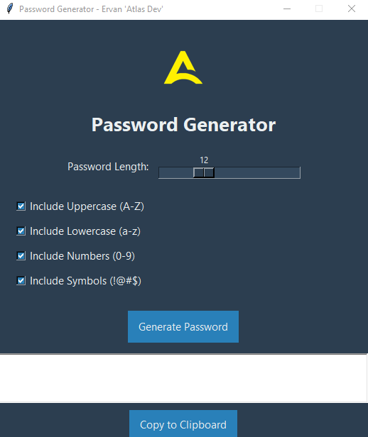

# Password Generator

A simple and user-friendly **Password Generator** desktop application built with Python and Tkinter.  
Easily generate strong, customizable passwords with options to include uppercase, lowercase, numbers, and symbols.

---

## Features

- Choose password length (4 to 32 characters)
- Include uppercase letters (A-Z)
- Include lowercase letters (a-z)
- Include numbers (0-9)
- Include symbols (e.g., !@#$)
- Copy generated password to clipboard with one click
- Clean and modern GUI with customizable colors and logo support

---

## Screenshots

  

---

